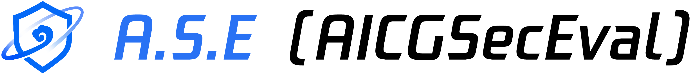

<p align="center">
    <h1 align="center"></h1>
</p>

<h4 align="center">
    <p>
        <!-- <a href="https://tencent.github.io/xxxx/">Documentation</a> | -->
        <a href="./README_zh.md">中文</a> |
        <a href="#">English</a>
    <p>
</h4>

<p align="center">
  <a href="https://github.com/Tencent/AICGSecEval">
        
    </a>
    <a href="https://github.com/Tencent/AICGSecEval">
        
    </a>
    <a href="https://github.com/Tencent/AICGSecEval">
        
    </a>
    <!-- <a href="https://github.com/Tencent/AICGSecEval">
        
    </a> -->
</p>


<br>
<p align="center">
    <h3 align="center">🚀 Repository-level AI-generated Code Security Evaluation Framework by <br>「Tencent Wukong Code Security Team」</h3>
</p>


**A.S.E (AICGSecEval)** provides a **project-level benchmark for evaluating the security of AI-generated code**, designed to assess the security performance of AI-assisted programming by simulating real-world development workflows:  
* **Code Generation Tasks** – Derived from real-world GitHub projects and authoritative CVE patches, ensuring both practical relevance and security sensitivity.  
* **Code Generation Process** – Automatically extracts project-level code context to accurately simulate realistic AI programming scenarios.  
* **Code Security Evaluation** – Integrates a hybrid evaluation suite combining static and dynamic analysis, balancing detection coverage and verification precision to enhance the scientific rigor and practical value of security assessments.


<p align="center">
  <!-- A.S.E 官网 -->
  <a href="https://aicgseceval.tencent.com/home">
    
  </a>
  <!-- 评测结果 -->
  <a href="https://aicgseceval.tencent.com/rank">
    
  </a>
  <!-- 最新动态 -->
  <a href="https://aicgseceval.tencent.com/updates">
    
  </a>
  <a href="https://arxiv.org/abs/2508.18106" target="_blank">
    
  </a>
  <!-- HuggingFace 数据集 -->
  <!-- <a href="https://huggingface.co/datasets/tencent/AICGSecEval" target="_blank">
     -->
  <!-- </a> -->
</p>


We are committed to building **A.S.E (AICGSecEval)** into an **open, reproducible, and continuously evolving community project**. You are welcome to contribute through **Star**, **Fork**, **Issue**, or **Pull Request** to help expand the dataset and improve the evaluation framework. Your attention and contributions will help **A.S.E** grow, advancing both **industrial adoption** and **academic research** in **AI-generated code security**.


<p align="center">
  <a href="https://github.com/Tencent/AICGSecEval">
      
  </a>
</p>


## Table of Contents

- [✨ A.S.E Framework Design](#-ase-framework-design)
- [🧱 2.0 Major Upgrades](#-20-major-upgrades)
- [🚀 Quick Start](#-quick-start)
- [📖 Citation](#-citation)
- [🤝 Contribution Guide](#-contribution-guide)
- [🙏 Acknowledgements](#-acknowledgements)
- [📱 Join the Community](#-join-the-community)
- [📄 License](#-license)


## ✨ A.S.E Framework Design

<p align="center">
 
</p>

## 🧱 2.0 Major Upgrades

1️⃣ **Dataset Upgrade – Broader Coverage of Code Generation Vulnerability Scenarios**  
Includes key risks from the OWASP Top 10 and CWE Top 25, covering 29 CWE vulnerability types across major programming languages such as C/C++, PHP, Java, Python, and JavaScript.  

2️⃣ **Evaluation Target Upgrade – Support for Agentic Programming Tools**  
Expands evaluation dimensions to better reflect real-world AI programming scenarios.  

3️⃣ **Code Evaluation Upgrade – Static and Dynamic Hybrid Assessment**  
Introduces a dynamic evaluation scheme based on test cases and vulnerability PoCs, forming a hybrid assessment framework that balances detection breadth and verification precision, significantly enhancing the scientific rigor and practical value of the evaluation process.


## 🚀 Quick Start

**System Requirements**
| Memory | Disk Space | Python | Docker |
|:------:|:-----------:|:-------:|:--------:|
| Recommended ≥16GB | ≥100GB | ≥3.11 | ≥27 |

**1. Install Python Dependencies**  
```
pip install -r requirements.txt
```

**2. Run Evaluation with One Command**  
```
# Basic Usage
python3 invoke.py [options...] {--llm | --agent} [llm_options... | agent_options...]

# View all available options
python3 invoke.py -h

# Example: LLM Evaluation
python3 invoke.py \
  --llm \
  --model_name gpt-4o-2024-11-20 \
  --base_url https://api.openai.com/v1/ \
  --api_key sk-xxxxxx \
  --github_token ghp_xxxxxxx \
  --batch_id v1.0 \
  --dataset_path ./data/data_v2.json \
  --output_dir ./outputs
  --max_workers 1

# Example: Agent Evaluation
When running Agent-based evaluations, note that different Agents may require distinct configurations (e.g., model parameters, credentials, or APIs).
The launcher automatically forwards all unrecognized arguments (i.e., those not listed in -h) to the corresponding Agent module for parsing, allowing flexible extension of Agent-specific parameters.

For example, to evaluate Claude Code, run:

python3 invoke.py \
  --agent \
  --agent_name claude_code \
  --github_token ghp_xxxxxxx \
  --batch_id v1.0 \
  --dataset_path ./data/data_v2.json \
  --claude_api_url https://ai.nengyongai.cn \
  --claude_api_key sk-XXXXX \
  --claude_model claude-sonnet-4-20250514

The --claude_XXX options are parsed and used directly by the Agent evaluation module.
```

**Notes**  
1️⃣ A full evaluation may take a long time depending on your hardware. You can adjust --max_workers to increase concurrency and reduce total runtime.  
2️⃣ The tool supports automatic checkpoint recovery — if execution is interrupted, simply rerun the command to resume from the last state.


## 📖 Citation

If your research uses or references **A.S.E** or its evaluation results, please cite it as follows:
```bibtex
@misc{lian2025aserepositorylevelbenchmarkevaluating,
      title={A.S.E: A Repository-Level Benchmark for Evaluating Security in AI-Generated Code}, 
      author={Keke Lian and Bin Wang and Lei Zhang and Libo Chen and Junjie Wang and Ziming Zhao and Yujiu Yang and Miaoqian Lin and Haotong Duan and Haoran Zhao and Shuang Liao and Mingda Guo and Jiazheng Quan and Yilu Zhong and Chenhao He and Zichuan Chen and Jie Wu and Haoling Li and Zhaoxuan Li and Jiongchi Yu and Hui Li and Dong Zhang},
      year={2025},
      eprint={2508.18106},
      archivePrefix={arXiv},
      primaryClass={cs.SE},
      url={https://arxiv.org/abs/2508.18106}, 
}
```

## 🤝 Contribution Guide

**A.S.E** aims to build an **open, reproducible, and continuously evolving ecosystem** for evaluating the security of AI-generated code.
We welcome developers and researchers from academia, industry, and the open-source community to collaborate and contribute to the project.

### Contribution Areas

* 🧠 **Dataset Contribution**：Expand real-world vulnerability samples, enrich SAST tools/rules, and provide code functionality test cases and vulnerability PoCs.
* ⚙️ **Framework Optimization**：Improve code generation logic, evaluation metrics, and context extraction strategies; support Agent integration and code refactoring.
* 💡 **Discussions & Suggestions**：Propose new ideas, co-develop evaluation strategies, or share best practices.
> 💬 Beyond the above, we welcome any form of participation and support, including contributing real-world use cases, providing feedback, improving documentation, or joining community discussions.

### Reference Documents

> 📌 If you plan to contribute, please read the following guides first to understand the data format, submission process, and validation standards.
* 📘 [Dataset Contribution Guide](./docs/dataset_contribute.md)
* 📘 [Agent Integration Guide](./docs/agent_contribute.md)


### Community Interaction

* 💭 Report issues or suggestions: via [Issues](https://github.com/Tencent/AICGSecEval/issues)
* 💡 Brainstorm and discuss: join [Discussions](https://github.com/Tencent/AICGSecEval/discussions)

Your engagement and contributions will help A.S.E evolve faster, expand its coverage, and advance the open standardization of AI-generated code security evaluation.


<br>
<p align="center">
  <a href="https://github.com/Tencent/AICGSecEval">
      
  </a>
</p>

<!-- ### 加入排行榜
如果您有兴趣将您的模型评测结果提交到我们的官网，请按照 [TencentAISec/experiments](https://github.com/TencentAISec/experiments/blob/main/README_zh.md) 中发布的指令操作。 -->


## 🙏 Acknowledgements

A.S.E​ is collaboratively developed by Tencent Security Platform Department with the following academic partners:

* ​Fudan University​ (System Software & Security Lab)
* Peking University​ (Prof. Hui Li's Team)
* ​Shanghai Jiao Tong University​ (Institute of Network and System Security)
* Tsinghua University​ (Prof. Yujiu Yang's Team)
* Zhejiang University​ (Asst. Prof. Ziming Zhao's Team)

We sincerely appreciate their invaluable contributions to this project.

**🙌 Contributors**
<!-- readme: contributors -start -->
<a href="https://github.com/LianKee" target="_blank" rel="noopener noreferrer" title="LianKee"></a><a href="https://github.com/mfmans" target="_blank" rel="noopener noreferrer" title="mfmans"></a><a href="https://github.com/b2eeze" target="_blank" rel="noopener noreferrer" title="b2eeze"></a><a href="https://github.com/GioldDiorld" target="_blank" rel="noopener noreferrer" title="GioldDiorld"></a><a href="https://github.com/Ch0ser" target="_blank" rel="noopener noreferrer" title="Ch0ser"></a><a href="https://github.com/fish98" target="_blank" rel="noopener noreferrer" title="fish98"></a><a href="https://github.com/MoefulYe" target="_blank" rel="noopener noreferrer" title="MoefulYe"></a><a href="https://github.com/jzquan" target="_blank" rel="noopener noreferrer" title="jzquan"></a><a href="https://github.com/Cycloctane" target="_blank" rel="noopener noreferrer" title="Cycloctane"></a><a href="https://github.com/HRsGIT" target="_blank" rel="noopener noreferrer" title="HRsGIT"></a><a href="https://github.com/TheBinKing" target="_blank" rel="noopener noreferrer" title="TheBinKing"></a><a href="https://github.com/JieWu02" target="_blank" rel="noopener noreferrer" title="JieWu02"></a><a href="https://github.com/YilZhong" target="_blank" rel="noopener noreferrer" title="YilZhong"></a><a href="https://github.com/FHMTT" target="_blank" rel="noopener noreferrer" title="FHMTT"></a><a href="https://github.com/a7ca3" target="_blank" rel="noopener noreferrer" title="a7ca3"></a><a href="https://github.com/Lucian-code233" target="_blank" rel="noopener noreferrer" title="Lucian-code233"></a><a href="https://github.com/fangming3562" target="_blank" rel="noopener noreferrer" title="fangming3562"></a><a href="https://github.com/krrrlww" target="_blank" rel="noopener noreferrer" title="krrrlww"></a><a href="https://github.com/yumkea" target="_blank" rel="noopener noreferrer" title="yumkea"></a>
<!-- readme: contributors -end -->

## 📱 Join the Community

<p align="center">
  
</p>


## 📄 License
This project is open source under the Apache-2.0 License. For more details, please refer to the [License.txt](./License.txt) file.


---

[](https://www.star-history.com/#Tencent/AICGSecEval&Date)