<p align="center">
    <h1 align="center"></h1>
</p>

<h4 align="center">
    <p>
        <!-- <a href="https://tencent.github.io/xxxx/">Documentation</a> | -->
        <a href="#">中文</a> |
        <a href="./README.md">English</a>
    <p>
</h4>

<p align="center">
  <a href="https://github.com/Tencent/AICGSecEval">
        
    </a>
    <a href="https://github.com/Tencent/AICGSecEval">
        
    </a>
    <a href="https://github.com/Tencent/AICGSecEval">
        
    </a>
    <!-- <a href="https://github.com/Tencent/AICGSecEval">
        
    </a> -->
</p>


<br>
<p align="center">
    <h3 align="center">🚀 「腾讯悟空代码安全团队」推出的行业首个项目级 AI 生成代码安全性评测框架</h3>
</p>


**A.S.E（AICGSecEval）** 提供了全新的项目级 AI 生成代码安全评测基准，旨在通过模拟真实世界 AI 编程过程，评估 AI 生成代码在安全性方面的表现： 
* **代码生成任务**：源自真实世界 GitHub 项目与权威 CVE 漏洞，兼顾开发场景的真实还原与安全敏感性；
* **代码生成过程**：自动提取项目级代码上下文，精准模拟真实 AI 编程场景；
* **代码安全评估**：集成了动静态协同的评估套件，兼顾检测广度与验证精度，显著提升安全评测的科学性与实用价值；

<p align="center">
  <!-- A.S.E 官网 -->
  <a href="https://aicgseceval.tencent.com/home">
    
  </a>
  <!-- 评测结果 -->
  <a href="https://aicgseceval.tencent.com/rank">
    
  </a>
  <!-- 最新动态 -->
  <a href="https://aicgseceval.tencent.com/updates">
    
  </a>
  <a href="https://arxiv.org/abs/2508.18106" target="_blank">
    
  </a>
  <!-- HuggingFace 数据集 -->
  <!-- <a href="https://huggingface.co/datasets/tencent/AICGSecEval" target="_blank">
     -->
  <!-- </a> -->
</p>


<p>
我们致力于将 A.S.E（AICGSecEval）打造成开放、可复现、持续进化的社区项目，欢迎通过 Star、Fork、Issue、Pull Request 参与数据扩展与评测改进，共同推动项目迭代与完善。您的关注与贡献将助力 A.S.E 持续成长，促进大模型在 AI 编程安全领域的产业落地与学术研究。
</p>

<p align="center">
  <a href="https://github.com/Tencent/AICGSecEval">
      
  </a>
</p>


## 目录

- [✨ A.S.E 框架设计](#-A.S.E-框架设计)
- [🧱 2.0 重磅升级](#-2.0-重磅升级)
- [🚀 快速开始](#-快速开始)
- [📖 引用](#-引用)
- [🤝 贡献指南](#-贡献指南)
- [🙏 致谢](#-致谢)
- [📱 加入社群](#-加入社群)
- [📄 开源协议](#-开源协议)


## ✨ A.S.E 框架设计

<p align="center">
 
</p>

## 🧱 2.0 重磅升级

1️⃣ **数据集升级 - 覆盖更广泛的代码生成漏洞场景**  
囊括 OWASP Top 10 与 CWE Top 25 重点风险，涉及 29 类 CWE 漏洞，涵盖 C/C++、PHP、Java、Python、JavaScript 等主流语言。

2️⃣ **评测对象升级 - 新增对 Agentic 编程工具的评测支持**  
拓展评测维度，更贴近真实 AI 编程场景。

3️⃣ **代码评估升级 - 动静态协同评估**  
引入基于测试用例与漏洞 PoC 的动态代码评估方案，形成动静态协同的评估体系，兼顾检测广度与验证精度，显著提升评测的科学性与实用价值。


## 🚀 快速开始

**系统要求**
| 内存 | 磁盘空间 | Python | Docker |
|:------:|:----------:|:----------:|:----------:|
| 推荐 16GB+ | 100GB+ | ≥ 3.11 | ≥ 27

**1. 安装 Python 依赖**  
```
pip install -r requirements.txt
```

**2. 一键启动评测**  
```
# 基本用法
python3 invoke.py [options...] {--llm | --agent} [llm_options... | agent_options...]

# 使用 -h 查看完整参数说明
python3 invoke.py -h

# LLM 评测运行示例
python3 invoke.py \
  --llm \
  --model_name gpt-4o-2024-11-20 \
  --base_url https://api.openai.com/v1/ \
  --api_key sk-xxxxxx \
  --github_token ghp_xxxxxxx \
  --batch_id v1.0 \
  --dataset_path ./data/data_v2.json \
  --output_dir ./outputs
  --max_workers 1

# Agent 评测运行示例
在启动 Agent 评测时，考虑到不同 Agent 可能会有不同的配置参数（如模型、权限、API 等），启动器会将所有未知参数（即不在 -h 帮助信息列出的选项）提交给对应的 Agent 评测模块进行解析，以实现对 Agent 配置参数的扩展。例如，对 Claude Code 进行评测时，可以使用以下方式启动：

python3 invoke.py \
  --agent \
  --agent_name claude_code \
  --github_token ghp_xxxxxxx \
  --batch_id v1.0 \
  --dataset_path ./data/data_v2.json \
  --claude_api_url https://ai.nengyongai.cn \
  --claude_api_key sk-XXXXX \
  --claude_model claude-sonnet-4-20250514

其中 --claude_XXX 几个选项由 Agent 评测模块解析使用。

```
注：完整评估耗时较长，用户可根据硬件条件设置并发数进行提速。工具内置断点重连机制，用户中断代码后只需直接运行代码即可继续执行。


## 📖 引用

如果您的研究工作使用或参考了 A.S.E 及其评测结果，请按照以下方式引用：
```bibtex
@misc{lian2025aserepositorylevelbenchmarkevaluating,
      title={A.S.E: A Repository-Level Benchmark for Evaluating Security in AI-Generated Code}, 
      author={Keke Lian and Bin Wang and Lei Zhang and Libo Chen and Junjie Wang and Ziming Zhao and Yujiu Yang and Miaoqian Lin and Haotong Duan and Haoran Zhao and Shuang Liao and Mingda Guo and Jiazheng Quan and Yilu Zhong and Chenhao He and Zichuan Chen and Jie Wu and Haoling Li and Zhaoxuan Li and Jiongchi Yu and Hui Li and Dong Zhang},
      year={2025},
      eprint={2508.18106},
      archivePrefix={arXiv},
      primaryClass={cs.SE},
      url={https://arxiv.org/abs/2508.18106}, 
}
```

## 🤝 贡献指南

A.S.E 致力于构建一个 开放、可复现、持续进化 的 AI 生成代码安全评测生态。
我们欢迎来自学术界、工业界及社区的开发者共同参与项目建设。

### 共建方向

* 🧠 **数据集共建**：扩展真实项目漏洞样本，补充SAST 工具/规则，代码功能测试用例与漏洞 PoC 等。
* ⚙️ **评测框架优化**：完善代码生成逻辑、评测指标、补充代码上下文策略，Agent 集成、代码重构等。
* 💡 **讨论与建议**：提出改进思路、共创评测策略或分享最佳实践。
> 💬 除以上方式外，我们也欢迎任何形式的参与与支持，包括贡献使用场景、提供反馈、优化文档或参与社区讨论。

### 参考文档

> 📌 若您希望参与共建，请优先阅读以下文档以了解数据格式、提交流程与验证标准。
* 📘 [数据集贡献指南](./docs/dataset_contribute.md)
* 📘 [Agent 集成指南](./docs/agent_contribute.md)


### 社区互动

* 💭 提出问题或建议：请通过 [Issues](https://github.com/Tencent/AICGSecEval/issues)
* 💡 头脑风暴与讨论：欢迎加入 [Discussions](https://github.com/Tencent/AICGSecEval/discussions)

您的关注与参与将帮助 A.S.E 更快迭代、覆盖更广场景，共同推动 AI 编程安全评测的开放标准化进程。

<br>
<p align="center">
  <a href="https://github.com/Tencent/AICGSecEval">
      
  </a>
</p>

<!-- ### 加入排行榜
如果您有兴趣将您的模型评测结果提交到我们的官网，请按照 [TencentAISec/experiments](https://github.com/TencentAISec/experiments/blob/main/README_zh.md) 中发布的指令操作。 -->


## 🙏 致谢

A.S.E​ 由腾讯安全平台部悟空代码安全团队联合以下学术单位共同建设：
* ​复旦大学​（系统软件与安全实验室）
* 北京大学​（李挥教授团队）
* 上海交通大学​（网络与系统安全研究所）
* 清华大学​（杨余久教授团队）
* 浙江大学​（赵子鸣研究员团队）

感谢各方对 A.S.E 的卓越贡献！


## 📱 加入社群

<p align="center">
  
</p>


## 📄 开源协议
本项目基于 Apache-2.0 许可证开源，详细信息请查阅 [License.txt](./License.txt) 文件。


---

[](https://www.star-history.com/#Tencent/AICGSecEval&Date)